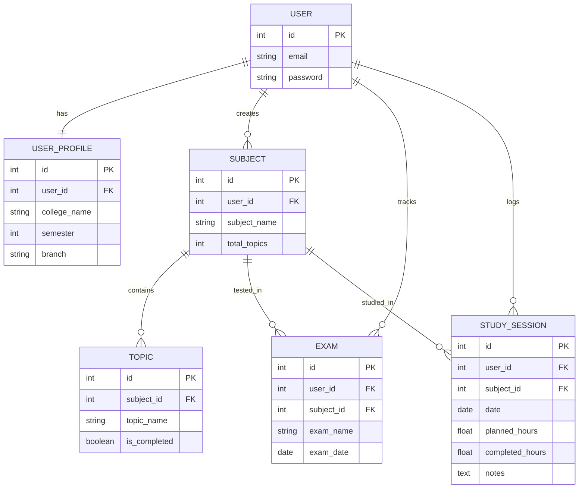

# StudyAI Implementation Plan

This document outlines the architecture and next steps for connecting the StudyAI frontend with the Django REST Framework backend.

## System Architecture

The following diagram illustrates the flow of data between the frontend, backend, authentication service, and database.

```mermaid
sequenceDiagram
    participant U as User / Browser
    participant F as Firebase Auth
    participant D as Django Backend (DRF)
    participant DB as PostgreSQL Database

    %% Authentication Flow
    rect rgb(30, 30, 46)
    Note over U,DB: 1. Authentication Phase
    U->>F: 1. Login with Google / Credentials
    F-->>U: 2. Return Firebase Token
    U->>D: 3. POST /api/auth/login/ (Send Token)
    D->>DB: 4. Get/Create User Profile
    DB-->>D: 5. Profile Data
    D-->>U: 6. Return JWT Session Token
    end

    %% Onboarding Flow
    rect rgb(20, 30, 40)
    Note over U,DB: 2. Onboarding Phase
    U->>D: 1. PUT /api/profile/update/ (College, Branch)
    D->>DB: 2. Update Profile
    U->>D: 3. POST /api/subjects/
    D->>DB: 4. Save Subjects
    U->>D: 5. POST /api/exams/
    D->>DB: 6. Save Exams
    end

    %% Dashboard Data Flow
    rect rgb(30, 20, 40)
    Note over U,DB: 3. Dashboard Loading
    U->>D: 1. GET /api/dashboard/
    D->>DB: 2. Fetch User Data (Exams, Sessions, Progress)
    DB-->>D: 3. Aggregated Data
    D-->>U: 4. Return Dashboard JSON
    end
```

## Django Entity Relationship (ER) Diagram

## Backend Implementation Phases

### Phase 1: Authentication & User Setup
1. Configure **Firebase Admin SDK** in Django to verify Google Login tokens.
2. Implement custom logic overriding SimpleJWT to issue Django JWTs upon successful Firebase verification.
3. Build the `UserProfile` model and the `PUT /api/profile/update/` endpoint.

### Phase 2: Core Models & CRUD APIs
1. Create `Subject`, [Topic](file:///c:/Users/SOUBHAGYA/Documents/projects/saas/index.html#1300-1304), and `Exam` models.
2. Build Django REST Framework `ModelViewSet` classes for each model.
3. Secure all endpoints to ensure users can only access their own data (`IsAuthenticated` + `IsOwner` permissions).

### Phase 3: Study Planner & Dashboard Analytics
1. Create the `StudySession` model.
2. Build specific aggregate endpoints:
   - `GET /api/dashboard/` to return summary statistics.
   - `GET /api/study-sessions/weekly-stats/` for the bar chart data.
   - `GET /api/subjects/progress/` for the circular progress indicators.

## Frontend Next Steps
1. Replace the placeholder `fetch` calls in [index.html](file:///c:/Users/SOUBHAGYA/Documents/projects/saas/index.html) with actual API requests to the deployed Django Railway backend.
2. Implement JWT token storage in `localStorage` or `sessionStorage`.
3. Add request interceptors to attach the `Authorization: Bearer <token>` header to all outgoing Django API requests.
